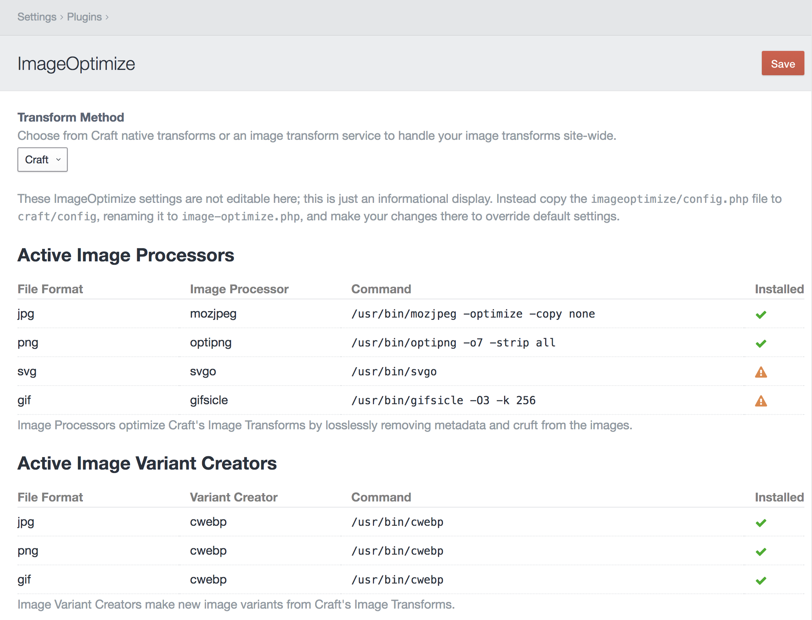

# Configuring ImageOptimize

The plugin Settings for ImageOptimize allows you to choose whether to use native Craft image transforms, or an image transform service such as [imgix](https://imgix.com), [Thumbor](http://thumbor.org/), or [Sharp JS](https://nystudio107.com/blog/setting-up-your-own-image-transform-service). The setting you choose here will apply globally to all of your image transforms.

## Native Craft Images

To create client-proof optimized images with native Craft transforms, you'll need to also install the image optimization tools of your choice. The ImageOptimize plugin Settings page will show you the status of your installed image optimization tools:

Here's how to install a few on Ubuntu 16.04:

* **jpegoptim** - `sudo apt-get install jpegoptim`
* **mozjpeg** - [Installing mozjpeg on Ubuntu 16.04 (Forge)](https://nystudio107.com/blog/installing-mozjpeg-on-ubuntu-16-04-forge)
* **optipng** - `sudo apt-get install optipng`
* **svgo** - `sudo npm install -g svgo`
* **gifsicle** - `sudo apt-get install gifsicle`
* **webp** - `sudo apt-get install webp`

ImageOptimize's responsive image transforms will work without these tools installed, but it's recommended that you use them to ensure the images are fully optimized.

The only configuration for ImageOptimize is in the `config.php` file, which is a multi-environment friendly way to store the default settings.  Don't edit this file, instead copy it to `craft/config` as `image-optimize.php` and make your changes there.

The `activeImageProcessors` array lets you specify which of the image optimization tools to use for which file types.

The `imageProcessors` array specifies the path and options for each of the image optimization tools.

The `activeImageVariantCreators` array lets you specify which of the image variant creators to use for which file types.

The `imageVariantCreators` array specifies the path and options for each of the image variant creators.

See each image optimization tool's documentation for details on the options they allow you to use.

## imgix Service Images

If you're using the [imgix](https://imgix.com) service, ImageOptimize allows you to use the Craft Control Panel UX/UI to create your image transforms, but have imgix do all of the heavy lifting for you. This means you can use imgix with zero template changes.

Craft will then use imgix for all Asset URLs, including the original image, its thumbnails, and any Asset transforms you create (whether in the Control Panel or via Twig templates).

To utilize imgix, you'll need to enter your **imgix Source Domain**, and your **imgix API Key** to allow for auto-purging of changed Assets:

Then configure your imgix source via your imgix.com account. If you're using a Web Folder as a source, make sure it's set to the root of your domain, since you can only have one per site:

Regardless of how many separate Craft Asset Volumes you've set up, you'll just have one Web Folder source.

For image transforms, and set both **Quality** and **Format** to `Auto` in the Control Panel, it’ll send along `auto=compress,format` to imgix, which will allow imgix to compress the image as it sees fit. See the [Automatic imgix Documentation](https://docs.imgix.com/apis/url/auto) for details.

You can also set an optional **imgix Security Token** if you wish to have [secure, signed image URLs](https://docs.imgix.com/setup/securing-images) from imgix.

Brought to you by [nystudio107](https://nystudio107.com)
