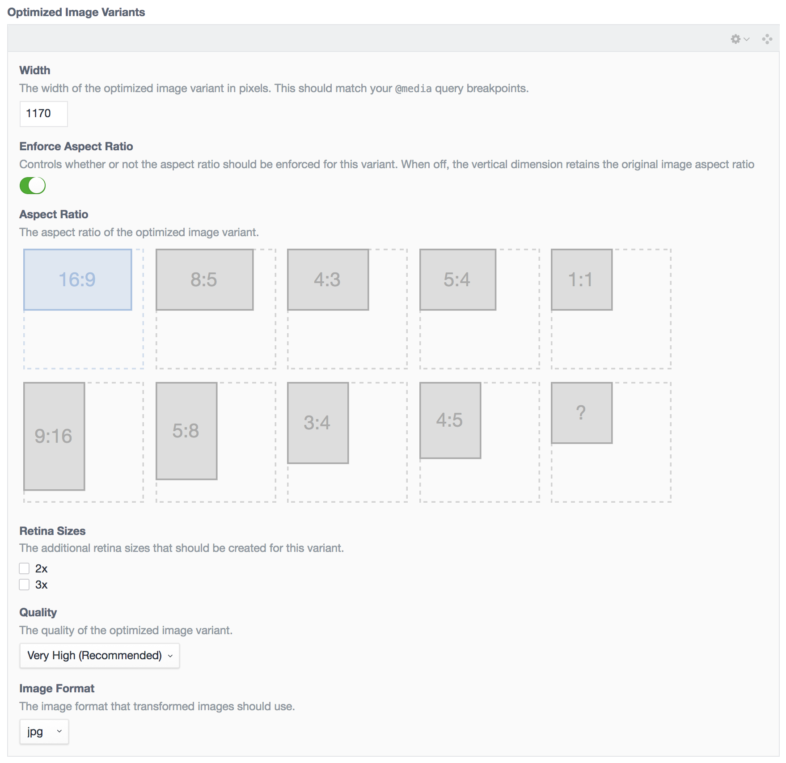
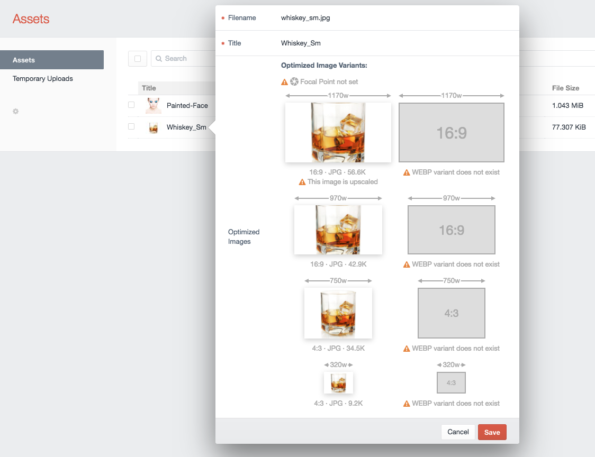
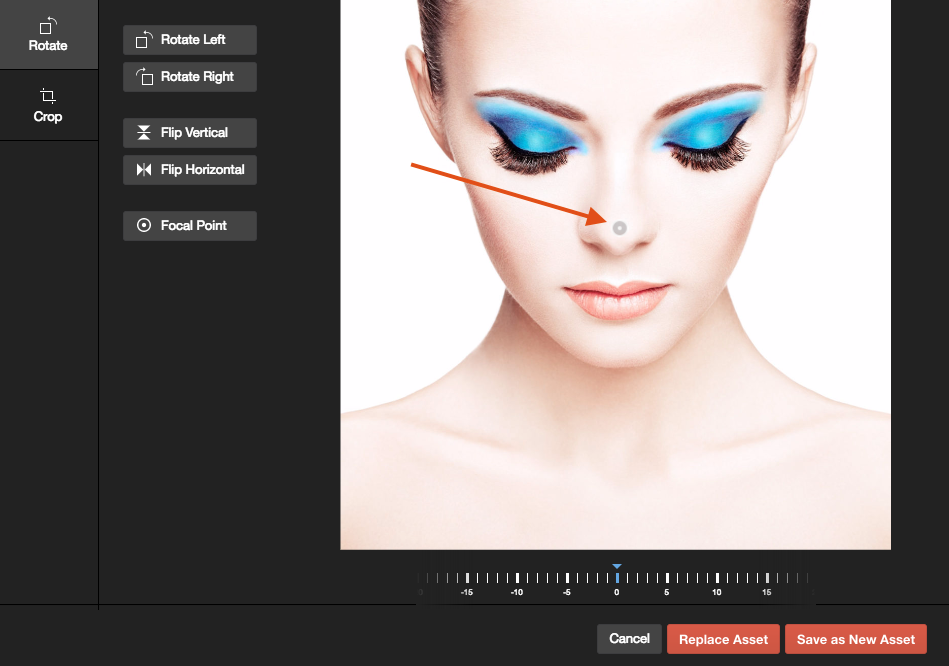

# Using ImageOptimize

## Using the Optimized Images Field

To create responsive image variants for all of your images, create an **OptimizedImages** Field and add it to the Asset Volume field layout of the images you want optimized.

ImageOptimize will pre-generate all of the Optimized Image Variants in the Asset Volume, so that this rather intensive step is preflighted, rather than being done at runtime.

You can choose to have the Optimized Image Variants created only for specific sub-folders in an Asset Volume if you like:


Think of each **Optimized Images** field as encapsulating a [srcset](https://cloudfour.com/thinks/responsive-images-101-part-4-srcset-width-descriptors/) for your images. To use more than one `srcset` then you probably need more than one **Optimized Images** field.

**Transform Method** let you choose to use the built-in Craft transforms or a service like [imgix](https://www.imgix.com/) for the responsive image variants.

You can then create as many Optimized Image Variants as you like:



You can add, delete, and re-order the Optimized Image Variants just like you can Matrix blocks.

For each Optimized Image Variant, set:

* **Width**: The width of the image, which should correspond to your CSS `@media` query breakpoints or container sizes. For performance, we want to images to be the exact size that they will be displayed on-screen.
* **Enforce Aspect Ratio**: Controls whether or not the aspect ratio should be enforced for this variant. When off, the vertical dimension retains the original image aspect ratio
* **Aspect Ratio**: Pick an aspect ratio for the image from the available choices, or create your own with the `?` aspect ratio.
* **Retina Sizes**: Check any additional retina sizes to create for this variant. For instance, a `100x60` image with with a `2x` retina size would _also_ create a `200x120` image.
* **Quality**: The quality of the generated image; if **Auto** is selected, it will use your `config/general.php` setting for `defaultImageQuality`
* **Image Format**: The file format of the generated image; if **Auto** is selected, it will use the original image’s file format. It’s recommended that you set this to `jpg` for most images, for client-proofing purposes.

Once you have set up your field, add it to your asset Volume’s layout via **Settings** &rarr; **Assets**, then click on your asset Volume, and click on **Field Layout**.

By default, ImageOptimize automatically will decrease the `quality` setting of retina images, as discussed in the [Retina revolution](https://www.netvlies.nl/blogs/retina-revolutie-follow) article. This allows for increasing the visual quality of the retina images while keeping the file size modest. You can disable this via the `lowerQualityRetinaImageVariants` setting in `config.php`.

Whenever you add an OptimizedImages field to an asset Volume’s layout, or make changes to an existing OptimizedImages field’s settings, it will automatically generate your responsive image variants for you.

If you double-click on an asset (or click on an asset, and choose **Edit Asset** from the gear menu), you will now see all of your responsive image variants for that image:


You’ll see the responsive width of each image variant above each thumbnail, with the aspect ratio, file format, and file size below it. If you have `.webp` image variants configured, you will see them here as well.

By default, ImageOptimize will not create Optimized Image Variants that would be up-scaled from the original source image. You can control this behavior via the `allowUpScaledImageVariants` setting in `config.php`.

If you click on an image thumbnail, it will open up the full size image in a new browser tab.

The OptimizedImages field also helps content editors by pointing out potential problems as well:



In this example, no **Focal Point** has been set via Craft 3’s built-in image editor. The **Focal Point** lets content editors choose what portion of the image is most important, and should be kept in the center of any transformed images:



There are also warnings indicating that the original image is too small, and is being upscaled for one of the responsive variants, and that `WEBP` hasn’t been configured, so there are no `.webp` variants created.

## Command-line Optimized Image Variant creation

Because web-based PHP often has timeouts such as `max_execution_time` that can be exceeded by very large image variant creation, ImageOptimize comes with a command-line utility to let you create the responsive image variants via console command.

### Console Commands

From the root directory of your Craft CMS 3 project, you can use the following commands:

```
php craft image-optimize/optimize/create
```

To generate only responsive image variants for a specific Asset Volume, you can do that by specifying the Volume’s `handle` via the console command:

```
php craft image-optimize/optimize/create myVolumeHandle
```

To generate only responsive image variants for a specific Optimized Images Field, you can do that by specifying the Field’s `handle` via the `--field` option:

```
php craft image-optimize/optimize/create --field=myFieldHandle
```

You can combine the two, and narrow things down to a specific volume and a specific field:

```
php craft image-optimize/optimize/create myVolumeHandle --field=myFieldHandle
```

To generate only responsive image variants for a specific Asset, you can do that by specifying the Asset ID via the console command `create-asset`:

```
php craft image-optimize/optimize/create-asset 101
```

### Forcing Image Variant Creation

The way Craft CMS asset transforms work, if a transformed image already exists, it won’t bother trying to recreate it.

This can sometimes be problematic when you add additional variants (such as `.webp`) after the fact, and need to generate them.

You can use the `--force` option with any of the above commands to force the recreation of the optimized image variants. This works by deleting the image variant just before recreating it:

```
php craft image-optimize/optimize/create --force
```

Or:

```
php craft image-optimize/optimize/create myVolumeHandle --field=myFieldHandle --force
```

```
php craft image-optimize/optimize/create-asset 101 --force
```

Etc.

### Disabling Automatic Variant Creation

Normally ImageOptimize will regenerate image variants if you change an OptimizedImages field, save the ImageOptimize preferences, or save an Assets Volume that contains an OptimizedImages field, to ensure that all of your image variants are in sync.

If you plan to do this manually via the above console commands, you can disable this behavior via the `automaticallyResaveImageVariants` setting in `config.php`.

## Displaying images on the frontend

ImageOptimize makes it easy to create responsive images in your frontend templates. There are two primary ways to create responsive images: using the `` element or using the `<picture>` element.

ImageOptimize provides simple but powerful shortcut commands for creating HTML markup from the Optimized Images field, or you can do it manually as well.

Generally speaking, you’ll usually want to have CSS like this applied to your images with a class:

```css
.responsive-img {
    width: 100%;
    height: auto;
}
```

This allows the images to have `height` and `width` attributes applied to them so the browser can load them without layout shifts, while also fitting appropriately in the container.

### Shortcut Method

ImageOptimize knows all about your images, and so can create the HTML markup for your `` and `<picture>` tags quickly and easily.

It uses a synthesis of modern best practices to generate the tags in an optimal way, without you having to worry about the details, or maintain a myriad of out of date Twig template partials.

All of the tag methods below support an Element Query-like chained syntax that lets you customize them:

```twig
    
    {{ asset.optimizedImagesField.imgTag()
        .loadingStrategy('lazy')
        .render() }}
```

...or you can pass the config into them as an object if you prefer that method:

```twig
    
    {{ asset.optimizedImagesField.imgTag({
        'loadingStrategy': 'lazy',
        }).render() }}
```

Either way, the result is the same, so pick whichever method you prefer. The example presented below will use the chained syntax.

#### Using `.imgTag()` to create `` tags

An OptimizedImages field has a `.imgTag()` method that will generate a complete `` tag for you. In its simplest form, it looks like this:

```twig
    
    {{ asset.optimizedImagesField.imgTag().render() }}
```

Which will generate the following HTML markup for you:

```html

```

The `imgTag()` also supports an Element Query-like API that lets you customize the `` tag that is output.

##### The `.imgAttrs()` Parameter

With `.imgAttrs()`, you can add or override any of the HTML attributes that will be included in the `` tag. For example, if you wanted the `sizes` attribute in set to `50vw`, and you wanted to add an `alt` attribute, you’d do the following:

```twig
    
    {{ asset.optimizedImagesField.imgTag()
        .imgAttrs({
            'sizes': '50vw',
            'alt': asset.title,
        })
        .render() }}
```

Which will generate the following HTML markup for you:

```html

```

Any attributes with empty values will not be rendered, so you can use that to remove any of the prepopulated attributes should you need to.

##### The `.loadingStrategy()` Parameter

With `.loadingStrategy()`, you can control how the image will be loaded.It can one of the following:

* `'eager'` - (default) load the image normally (no lazy loading)
* `'lazy'` - us the browser’s built-in lazy loading via the `loading="lazy"` attribute
* `'lazySizes'` - use the lazysizes JavaScript library for lazy loading the image
* `'lazySizesFallback'` - use the browser’s built-in lazy loading, falling back on the lazysizes JavaScript library if the browser doesn’t support native lazy loading

###### Using `.loadingStrategy('eager')`

`.loadingStrategy('eager')` is the default, which causes the image to be loader eagerly.

You’d typically want this for "above the fold" images that should be rendered as soon as possible.

```twig
    
    {{ asset.optimizedImagesField.imgTag()
        .loadingStrategy('eager')
        .render() }}
```

Which will generate the following HTML markup for you:

```html

```

###### Using `.loadingStrategy('lazy')`

`.loadingStrategy('lazy')` will load the image lazily via native browser [lazing loading](https://web.dev/articles/browser-level-image-lazy-loading) by adding `class="lazyload"` and `loading="lazy"` attributes to the image.

This leverages native browser lazy loading of images, without the need for additional JavaScript code.

You’d typically want this for "below the fold" images that the browser can load lazily as needed.

```twig
    
    {{ asset.optimizedImagesField.imgTag()
        .loadingStrategy('lazy')
        .render() }}
```

Which will generate the following HTML markup for you:

```html

```

Note that it sets the background image to the OptimizedImage’s placeholder via the `style` attribute, sp the placeholder image will be visible until the actual image loads.

###### Using `.loadingStrategy('lazySizes')`

`.loadingStrategy('lazySizes')` will load the image lazily via the [lazysizes](https://github.com/aFarkas/lazysizes) library. You’d typically want this for "below the fold" images that the browser can load lazily as needed.

This allows you to support lazy loading of images even with browsers that don’t support native lazy loading.

You’d typically want this for "below the fold" images that the browser can load lazily as needed.

```twig
    
    {{ asset.optimizedImagesField.imgTag()
        .loadingStrategy('lazySizes')
        .render() }}
```

Which will generate the following HTML markup for you:

```html

```

It’s expected that you will have loaded the lazysizes library already on the frontend via your JavaScript build system, but if you want ImageOptimize to include the lazysizes JavaScript for you via CDN you can do the following anywhere in the `<body>` of your HTML:

```twig
    {{ craft.imageOptimize.renderLazySizesJs() }}
```

Note that it sets the background image to the OptimizedImage’s placeholder via the `style` attribute, sp the placeholder image will be visible until the actual image loads.

###### `.loadingStrategy('lazySizesFallback')`

`.loadingStrategy('lazySizesFallback')` will load the image lazily via the native browser [lazing loading](https://web.dev/articles/browser-level-image-lazy-loading), but will fall back on using the [lazysizes](https://github.com/aFarkas/lazysizes) library if the browser doesn’t support native lazy loading.

This is the best of both worlds, in terms of using native browser lazy loading if it’s available, and falling back on lazysizes JavaScript if it is not.

You’d typically want this for "below the fold" images that the browser can load lazily as needed.

```twig
    
    {{ asset.optimizedImagesField.imgTag()
        .loadingStrategy('lazySizesFallback')
        .render() }}
```

Which will generate the following HTML markup for you:

```html

```

Then you just need to include the [lazysizes fallback script](https://web.dev/articles/browser-level-image-lazy-loadingS#how_do_i_handle_browsers_that_dont_support_lazy_loading) in your `<body>` tag somewhere with:

```twig
    {{ craft.imageOptimize.renderLazySizesFallbackJs() }}
```

Note that it sets the background image to the OptimizedImage’s placeholder via the `style` attribute, sp the placeholder image will be visible until the actual image loads.

##### The `.placeholder()` Parameter

With `.placeholder()`, you can set the type of placeholder image that should be used for lazy loaded images. It can one of the following:

* `'box'` - (default) a simple SVG box that’s the same size as the final image
* `'color'` - a SVG box that uses the predominant color from the image as the backrground color
* `'image'` - a base64 encoded low quality placeholder image ([LQPI](https://csswizardry.com/2023/09/the-ultimate-lqip-lcp-technique/)) version of the image
* `'silhouette'` - a generated SVG image that is a silhouette of the actual image

```twig
    
    {{ asset.optimizedImagesField.imgTag()
        .placeholder('image')
        .loadingStrategy('lazy')
        .render() }}
```

Which will generate the following HTML markup for you:

```html

```

#### Using `.pictureTag()` to create `<picture>` tags

An OptimizedImages field has a `.pictureTag()` method that will generate a complete `<picture>` tag with embedded `<srcset>` and `` tags for you. In its simplest form, it looks like this:

```twig
    
    {{ asset.optimizedImagesField.pictureTag().render() }}
```

Which will generate the following HTML markup for you:

```html
<picture>
    <source type="image/webp"
            srcset="/assets/site/_576x432_crop_center-center_60_line/christmas-selfie.jpg.webp 576w,
                    /assets/site/_768x576_crop_center-center_60_line/christmas-selfie.jpg.webp 768w,
                    /assets/site/_992x558_crop_center-center_82_line/christmas-selfie.jpg.webp 992w,
                    /assets/site/_1200x675_crop_center-center_82_line/christmas-selfie.jpg.webp 1200w"
            width="1200"
            height="675"
            sizes="100vw"
    >
    <source srcset="/assets/site/_576x432_crop_center-center_60_line/christmas-selfie.jpg 576w,
                    /assets/site/_768x576_crop_center-center_60_line/christmas-selfie.jpg 768w,
                    /assets/site/_992x558_crop_center-center_82_line/christmas-selfie.jpg 992w,
                    /assets/site/_1200x675_crop_center-center_82_line/christmas-selfie.jpg 1200w"
            width="1200"
            height="675"
            sizes="100vw"
    >
    
</picture>
```

The `pictureTag()` also supports an Element Query-like API that lets you customize the `<picture>` tag that is output.

##### The `.imgAttrs()` Parameter

With `.imgAttrs()`, you can add or override any of the HTML attributes that will be included in the embedded `` tag. For example, if you wanted to add an `alt` attribute, you’d do the following:

```twig
    
    {{ asset.optimizedImagesField.pictureTag()
        .imgAttrs({
            'alt': asset.title,
        })
        .render() }}
```

Which will generate the following HTML markup for you:

```html
<picture>
    <source type="image/webp"
            srcset="/assets/site/_576x432_crop_center-center_60_line/christmas-selfie.jpg.webp 576w,
                    /assets/site/_768x576_crop_center-center_60_line/christmas-selfie.jpg.webp 768w,
                    /assets/site/_992x558_crop_center-center_82_line/christmas-selfie.jpg.webp 992w,
                    /assets/site/_1200x675_crop_center-center_82_line/christmas-selfie.jpg.webp 1200w"
            width="1200"
            height="675"
            sizes="100vw"
    >
    <source srcset="/assets/site/_576x432_crop_center-center_60_line/christmas-selfie.jpg 576w,
                    /assets/site/_768x576_crop_center-center_60_line/christmas-selfie.jpg 768w,
                    /assets/site/_992x558_crop_center-center_82_line/christmas-selfie.jpg 992w,
                    /assets/site/_1200x675_crop_center-center_82_line/christmas-selfie.jpg 1200w"
            width="1200"
            height="675"
            sizes="100vw"
    >
    
</picture>
```

Any attributes with empty values will not be rendered, so you can use that to remove any of the prepopulated attributes should you need to.

##### The `.loadingStrategy()` Parameter

With `.loadingStrategy()`, you can control how the image will be loaded.

###### Using `.loadingStrategy('eager')`

`.loadingStrategy('eager')` is the default, which causes the image to be loader eagerly.

You’d typically want this for "above the fold" images that should be rendered as soon as possible.

```twig
    
    {{ asset.optimizedImagesField.pictureTag()
        .loadingStrategy('eager')
        .render() }}
```

Which will generate the following HTML markup for you:

```html
<picture>
    <source type="image/webp"
            srcset="/assets/site/_576x432_crop_center-center_60_line/christmas-selfie.jpg.webp 576w,
                    /assets/site/_768x576_crop_center-center_60_line/christmas-selfie.jpg.webp 768w,
                    /assets/site/_992x558_crop_center-center_82_line/christmas-selfie.jpg.webp 992w,
                    /assets/site/_1200x675_crop_center-center_82_line/christmas-selfie.jpg.webp 1200w"
            width="1200"
            height="675"
            sizes="100vw"
    >
    <source srcset="/assets/site/_576x432_crop_center-center_60_line/christmas-selfie.jpg 576w,
                    /assets/site/_768x576_crop_center-center_60_line/christmas-selfie.jpg 768w,
                    /assets/site/_992x558_crop_center-center_82_line/christmas-selfie.jpg 992w,
                    /assets/site/_1200x675_crop_center-center_82_line/christmas-selfie.jpg 1200w"
            width="1200"
            height="675"
            sizes="100vw"
    >
    
</picture>
```

###### Using `.loadingStrategy('lazy')`

`.loadingStrategy('lazy')` will load the image lazily via native browser [lazing loading](https://web.dev/articles/browser-level-image-lazy-loading) by adding `class="lazyload"` and `loading="lazy"` attributes to the image.

This leverages native browser lazy loading of images, without the need for additional JavaScript code.

You’d typically want this for "below the fold" images that the browser can load lazily as needed.

```twig
    
    {{ asset.optimizedImagesField.pictureTag()
        .loadingStrategy('lazy')
        .render() }}
```

Which will generate the following HTML markup for you:

```html
<picture>
    <source type="image/webp"
            srcset="/assets/site/_576x432_crop_center-center_60_line/christmas-selfie.jpg.webp 576w,
                    /assets/site/_768x576_crop_center-center_60_line/christmas-selfie.jpg.webp 768w,
                    /assets/site/_992x558_crop_center-center_82_line/christmas-selfie.jpg.webp 992w,
                    /assets/site/_1200x675_crop_center-center_82_line/christmas-selfie.jpg.webp 1200w"
            width="1200"
            height="675"
            sizes="100vw"
    >
    <source srcset="/assets/site/_576x432_crop_center-center_60_line/christmas-selfie.jpg 576w,
                    /assets/site/_768x576_crop_center-center_60_line/christmas-selfie.jpg 768w,
                    /assets/site/_992x558_crop_center-center_82_line/christmas-selfie.jpg 992w,
                    /assets/site/_1200x675_crop_center-center_82_line/christmas-selfie.jpg 1200w"
            width="1200"
            height="675"
            sizes="100vw"
    >
    
</picture>
```

Note that it sets the background image to the OptimizedImage’s placeholder via the `style` attribute, sp the placeholder image will be visible until the actual image loads.

###### Using `.loadingStrategy('lazySizes')`

`.loadingStrategy('lazySizes')` will load the image lazily via the [lazysizes](https://github.com/aFarkas/lazysizes) library. You’d typically want this for "below the fold" images that the browser can load lazily as needed.

This allows you to support lazy loading of images even with browsers that don’t support native lazy loading.

You’d typically want this for "below the fold" images that the browser can load lazily as needed.

```twig
    
    {{ asset.optimizedImagesField.pictureTag()
        .loadingStrategy('lazySizes')
        .render() }}
```

Which will generate the following HTML markup for you:

```html
<picture>
    <source type="image/webp"
            width="1200"
            height="675"
            data-sizes="100vw"
            data-srcset="/assets/site/_576x432_crop_center-center_60_line/christmas-selfie.jpg.webp 576w,
                        /assets/site/_768x576_crop_center-center_60_line/christmas-selfie.jpg.webp 768w,
                        /assets/site/_992x558_crop_center-center_82_line/christmas-selfie.jpg.webp 992w,
                        /assets/site/_1200x675_crop_center-center_82_line/christmas-selfie.jpg.webp 1200w"
    >
    <source width="1200"
            height="675"
            data-sizes="100vw"
            data-srcset="/assets/site/_576x432_crop_center-center_60_line/christmas-selfie.jpg 576w,
                                 /assets/site/_768x576_crop_center-center_60_line/christmas-selfie.jpg 768w,
                                 /assets/site/_992x558_crop_center-center_82_line/christmas-selfie.jpg 992w,
                                 /assets/site/_1200x675_crop_center-center_82_line/christmas-selfie.jpg 1200w"
    >
    
</picture>
```

It’s expected that you will have loaded the lazysizes library already on the frontend via your JavaScript build system, but if you want ImageOptimize to include the lazysizes JavaScript for you via CDN you can do the following anywhere in the `<body>` of your HTML:

```twig
    {{ craft.imageOptimize.renderLazySizesJs() }}
```

Note that it sets the background image to the OptimizedImage’s placeholder via the `style` attribute, sp the placeholder image will be visible until the actual image loads.

###### `.loadingStrategy('lazySizesFallback')`

`.loadingStrategy('lazySizesFallback')` will load the image lazily via the native browser [lazing loading](https://web.dev/articles/browser-level-image-lazy-loading), but will fall back on using the [lazysizes](https://github.com/aFarkas/lazysizes) library if the browser doesn’t support native lazy loading.

This is the best of both worlds, in terms of using native browser lazy loading if it’s available, and falling back on lazysizes JavaScript if it is not.

You’d typically want this for "below the fold" images that the browser can load lazily as needed.

```twig
    
    {{ asset.optimizedImagesField.pictureTag()
        .loadingStrategy('lazySizesFallback')
        .render() }}
```

Which will generate the following HTML markup for you:

```html
<picture>
    <source type="image/webp"
            width="1200"
            height="675"
            data-sizes="100vw"
            data-srcset="/assets/site/_576x432_crop_center-center_60_line/christmas-selfie.jpg.webp 576w,
                         /assets/site/_768x576_crop_center-center_60_line/christmas-selfie.jpg.webp 768w,
                         /assets/site/_992x558_crop_center-center_82_line/christmas-selfie.jpg.webp 992w,
                         /assets/site/_1200x675_crop_center-center_82_line/christmas-selfie.jpg.webp 1200w"
    >
    <source width="1200"
            height="675"
            data-sizes="100vw"
            data-srcset="/assets/site/_576x432_crop_center-center_60_line/christmas-selfie.jpg 576w,
                         /assets/site/_768x576_crop_center-center_60_line/christmas-selfie.jpg 768w,
                         /assets/site/_992x558_crop_center-center_82_line/christmas-selfie.jpg 992w,
                         /assets/site/_1200x675_crop_center-center_82_line/christmas-selfie.jpg 1200w"
    >
    
</picture>
```

Then you just need to include the [lazysizes fallback script](https://web.dev/articles/browser-level-image-lazy-loadingS#how_do_i_handle_browsers_that_dont_support_lazy_loading) in your `<body>` tag somewhere with:

```twig
    {{ craft.imageOptimize.renderLazySizesFallbackJs() }}
```

Note that it sets the background image to the OptimizedImage’s placeholder via the `style` attribute, sp the placeholder image will be visible until the actual image loads.

##### The `.placeholder()` Parameter

With `.placeholder()`, you can set the type of placeholder image that should be used for lazy loaded images. It can one of the following:

* `'box'` - (default) a simple SVG box that’s the same size as the final image
* `'color'` - a SVG box that uses the predominant color from the image as the backrground color
* `'image'` - a base64 encoded low quality placeholder image ([LQPI](https://csswizardry.com/2023/09/the-ultimate-lqip-lcp-technique/)) version of the image
* `'silhouette'` - a generated SVG image that is a silhouette of the actual image

```twig
    
    {{ asset.optimizedImagesField.pictureTag()
        .placeholder('image')
        .loadingStrategy('lazy')
        .render() }}
```

Which will generate the following HTML markup for you:

```html
<picture>
    <source type="image/webp"
            srcset="/assets/site/_576x432_crop_center-center_60_line/christmas-selfie.jpg.webp 576w,
                    /assets/site/_768x576_crop_center-center_60_line/christmas-selfie.jpg.webp 768w,
                    /assets/site/_992x558_crop_center-center_82_line/christmas-selfie.jpg.webp 992w,
                    /assets/site/_1200x675_crop_center-center_82_line/christmas-selfie.jpg.webp 1200w"
            width="1200"
            height="675"
            sizes="100vw"
    >
    <source srcset="/assets/site/_576x432_crop_center-center_60_line/christmas-selfie.jpg 576w,
                    /assets/site/_768x576_crop_center-center_60_line/christmas-selfie.jpg 768w,
                    /assets/site/_992x558_crop_center-center_82_line/christmas-selfie.jpg 992w,
                    /assets/site/_1200x675_crop_center-center_82_line/christmas-selfie.jpg 1200w"
            width="1200"
            height="675"
            sizes="100vw"
    >
    
</picture>
```

##### The `.pictureAttrs()` Parameter

With `.pictureAttrs()`, you can add or override any of the HTML attributes that will be included in the `<picture>` tag. For example, if you wanted to add a `class` attribute to the `<picture>` tag, you’d do the following:

```twig
    
    {{ asset.optimizedImagesField.pictureTag()
        .pictureAttrs({
            'class': 'some-css-class',
        })
        .render() }}
```

Which will generate the following HTML markup for you:

```html
<picture class="some-css-class">
    <source type="image/webp"
            srcset="/assets/site/_576x432_crop_center-center_60_line/christmas-selfie.jpg.webp 576w,
                    /assets/site/_768x576_crop_center-center_60_line/christmas-selfie.jpg.webp 768w,
                    /assets/site/_992x558_crop_center-center_82_line/christmas-selfie.jpg.webp 992w,
                    /assets/site/_1200x675_crop_center-center_82_line/christmas-selfie.jpg.webp 1200w"
            width="1200"
            height="675"
            sizes="100vw"
    >
    <source srcset="/assets/site/_576x432_crop_center-center_60_line/christmas-selfie.jpg 576w,
                    /assets/site/_768x576_crop_center-center_60_line/christmas-selfie.jpg 768w,
                    /assets/site/_992x558_crop_center-center_82_line/christmas-selfie.jpg 992w,
                    /assets/site/_1200x675_crop_center-center_82_line/christmas-selfie.jpg 1200w"
            width="1200"
            height="675"
            sizes="100vw"
    >
    
</picture>
```

Any attributes with empty values will not be rendered, so you can use that to remove any of the prepopulated attributes should you need to.

##### The `.sourceAttrs()` Parameter

With `.sourceAttrs()`, you can add or override any of the HTML attributes that will be included in the embedded `<source>` tags. For example, if you wanted to add a `media` attribute, you’d do the following:

```twig
    
    {{ asset.optimizedImagesField.pictureTag()
        .sourceAttrs({
            'media': '(min-width: 800px)',
        })
        .render() }}
```

Which will generate the following HTML markup for you:

```html
<picture>
    <source type="image/webp"
            srcset="/assets/site/_576x432_crop_center-center_60_line/christmas-selfie.jpg.webp 576w,
                    /assets/site/_768x576_crop_center-center_60_line/christmas-selfie.jpg.webp 768w,
                    /assets/site/_992x558_crop_center-center_82_line/christmas-selfie.jpg.webp 992w,
                    /assets/site/_1200x675_crop_center-center_82_line/christmas-selfie.jpg.webp 1200w"
            width="1200"
            height="675"
            sizes="100vw"
            media="(min-width: 800px)"
    >
    <source srcset="/assets/site/_576x432_crop_center-center_60_line/christmas-selfie.jpg 576w,
                    /assets/site/_768x576_crop_center-center_60_line/christmas-selfie.jpg 768w,
                    /assets/site/_992x558_crop_center-center_82_line/christmas-selfie.jpg 992w,
                    /assets/site/_1200x675_crop_center-center_82_line/christmas-selfie.jpg 1200w"
            width="1200"
            height="675"
            sizes="100vw"
            media="(min-width: 800px)"
    >
    
</picture>
```

Any attributes with empty values will not be rendered, so you can use that to remove any of the prepopulated attributes should you need to.

##### The `.addSourceFrom()` Parameter

Since each OptimizedImages field can be thought of as encapsulating a [srcset](https://cloudfour.com/thinks/responsive-images-101-part-4-srcset-width-descriptors/) for your images, if you require art direction where images change aspect ratios at different screen sizes, then you should use another OptimizedImages field for each art direction.

With `.addSourceFrom()`, you can add the `<source>` tags from additional OptimizedImages fields to an output `<picture>` tag for art direction purposes. The first argument is the OptimizedImages field to pull the art direction `srcset` from, and the second argument is any `sourceAttrs` you want to set on the `<source>` tags:

```twig
    
    {{ asset.optimizedImagesField.pictureTag()
        .loadingStrategy('lazy')
        .sourceAttrs({
            'media': '(min-width: 800px)',
            'sizes': '80vw',
        })
        .addSourceFrom(asset.mobileOptimizedImagesField, {
            'media': '(max-width: 799px)',
            'sizes': '60vw',
        })
        .render() }}
```

Which will generate the following HTML markup for you:

```html
<picture>
    <source type="image/webp"
            srcset="/assets/site/_576x432_crop_center-center_60_line/christmas-selfie.jpg.webp 576w,
                    /assets/site/_768x576_crop_center-center_60_line/christmas-selfie.jpg.webp 768w,
                    /assets/site/_992x558_crop_center-center_82_line/christmas-selfie.jpg.webp 992w,
                    /assets/site/_1200x675_crop_center-center_82_line/christmas-selfie.jpg.webp 1200w"
            width="1200"
            height="675"
            media="(min-width: 800px)"
            sizes="80vw"
    >
    <source srcset="/assets/site/_576x432_crop_center-center_60_line/christmas-selfie.jpg 576w,
                    /assets/site/_768x576_crop_center-center_60_line/christmas-selfie.jpg 768w,
                    /assets/site/_992x558_crop_center-center_82_line/christmas-selfie.jpg 992w,
                    /assets/site/_1200x675_crop_center-center_82_line/christmas-selfie.jpg 1200w"
            width="1200"
            height="675"
            media="(min-width: 800px)"
            sizes="80vw"
    >
    <source type="image/webp"
            srcset="/assets/site/_576x720_crop_center-center_60_line/christmas-selfie.jpg.webp 576w,
                    /assets/site/_768x1024_crop_center-center_60_line/christmas-selfie.jpg.webp 768w,
                    /assets/site/_992x1587_crop_center-center_82_line/christmas-selfie.jpg.webp 992w,
                    /assets/site/_1200x2133_crop_center-center_82_line/christmas-selfie.jpg.webp 1200w"
            width="1200"
            height="2133"
            media="(max-width: 799px)"
            sizes="60vw"
    >
    <source srcset="/assets/site/_576x720_crop_center-center_60_line/christmas-selfie.jpg 576w,
                    /assets/site/_768x1024_crop_center-center_60_line/christmas-selfie.jpg 768w,
                    /assets/site/_992x1587_crop_center-center_82_line/christmas-selfie.jpg 992w,
                    /assets/site/_1200x2133_crop_center-center_82_line/christmas-selfie.jpg 1200w"
            width="1200"
            height="2133"
            media="(max-width: 799px)"
            sizes="60vw"
    >
    
</picture>
```

Any attributes with empty values will not be rendered, so you can use that to remove any of the prepopulated attributes should you need to.

#### Using `.linkPreloadTag()` to create `<link rel="preload">` tags

An OptimizedImages field has a `.linkPreloadTag()` method that will generate a complete `<link rel="preload">` tag for you.

This lets you give the browser hints to [preload image srcsets](https://web.dev/articles/preload-responsive-images#imagesrcset_and_imagesizes) to ensure the important images like above the fold hero images are loaded as quickly as possible.

You’d want these `<link rel="preload">` tags to be rendered somewhere high up in your HTML `<head>` so the browser can start prefetching them ASAP. In its simplest form, it looks like this:

```twig
    
    {{ asset.optimizedImagesField.linkPreloadTag().render() }}
```

Which will generate the following HTML markup for you:

```html
<link href="/assets/site/_576x432_crop_center-center_60_line/christmas-selfie.jpg.webp"
      rel="preload"
      as="image"
      imagesrcset="/assets/site/_576x432_crop_center-center_60_line/christmas-selfie.jpg.webp 576w,
                   /assets/site/_768x576_crop_center-center_60_line/christmas-selfie.jpg.webp 768w,
                   /assets/site/_992x558_crop_center-center_82_line/christmas-selfie.jpg.webp 992w,
                   /assets/site/_1200x675_crop_center-center_82_line/christmas-selfie.jpg.webp 1200w"
      imagesizes="100vw"
>
```

Any browser that supports `<link rel="preload">` tags _also_ supports `.webp` so it will prefer `.webp` images if they are available, but will fall back on the regular images otherwise.

The `linkPreloadTag()` also supports an Element Query-like API that lets you customize the `<link>` tag that is output.

##### The `.linkAttrs()` Parameter

With `.linkAttrs()`, you can add or override any of the HTML attributes that will be included in the `<link rel="preload">` tag. For example, if you wanted to add a `media` attribute, you’d do the following:

```twig
    
    {{ asset.optimizedImagesField.linkPreloadTag()
        .linkAttrs({
            'media': '(min-width: 800px)',
        })
        .render() }}
```

Which will generate the following HTML markup for you:

```html
<link href="/assets/site/_576x432_crop_center-center_60_line/christmas-selfie.jpg.webp"
      rel="preload"
      as="image"
      imagesrcset="/assets/site/_576x432_crop_center-center_60_line/christmas-selfie.jpg.webp 576w,
                   /assets/site/_768x576_crop_center-center_60_line/christmas-selfie.jpg.webp 768w,
                   /assets/site/_992x558_crop_center-center_82_line/christmas-selfie.jpg.webp 992w,
                   /assets/site/_1200x675_crop_center-center_82_line/christmas-selfie.jpg.webp 1200w"
      imagesizes="100vw"
      media="(min-width: 800px)"
>
```

Any attributes with empty values will not be rendered, so you can use that to remove any of the prepopulated attributes should you need to.

### Manual Method

You can also manually create your HTML markup for `` and `<picture>` tags as well.

#### Img srcset

To use `` elements in your templates, you can just do:

```twig
    
    
```

...where `myAssetField` is your Assets field, and `optimizedImagesField` is your OptimizedImages field. This will result in HTML like this being generated for you:

```twig
    
```

The `.src()` method simply displays the first responsive image variant, and is typically just used as a fallback for browsers that don’t support srcset. You can also pass in an optional `width` parameter to have it return a variant of that width:

```twig
    
    
```

There is also a corresponding `.srcWebp()` method, should you need it.

The `.srcset()` method displays all of the responsive image variants, with their associated source widths.

The `sizes` attribute here is a simple one that just matches the browser’s width, but you can use any media query you like (and typically would have it match your CSS media query breakpoints or container sizes). For information on how `srcset` works, check out the excellent [Responsive Images 101, Part 5: Sizes](https://cloudfour.com/thinks/responsive-images-101-part-5-sizes/) article.

If you’re using the [LazySizes](https://github.com/aFarkas/lazysizes) JavaScript for lazy image loading, your template code would look like this:

```twig
    
    
```

To check to see if `.webp` is supported on the server so you can conditionally include `.webp` images, you can do:

```twig


```

#### Picture Elements

To use `<picture>` in your templates, you can just do:

```twig
    
    <picture>
        <source srcset="{{ optimizedImages.srcsetWebP() }}" 
                 sizes="100vw"
                 type="image/webp" />
        
     </picture>
```

...where `myAssetField` is your Assets field, and `optimizedImagesField` is your OptimizedImages field. This will result in HTML like this being generated for you:

```twig
    <picture>
        <source srcset="/assets/_1170x658_crop_center-center/painted-face.jpg.webp 1170w,
                         /assets/_970x545_crop_center-center/painted-face.jpg.webp 970w,
                         /assets/_750x562_crop_center-center/painted-face.jpg.webp 750w,
                         /assets/_320x240_crop_center-center/painted-face.jpg.webp 320w"
                 sizes="100vw"
                 type="image/webp" />
        
    </picture>
```

This assumes you have `WEBP` image variants configured. This lets the browser choose what to display, if it can handle `.webp`, it’ll pick that (because `.webp` images are far more efficient than `.jpg` images), otherwise it’ll just use the regular image.

The `sizes` attribute here is a simple one that just matches the browser’s width, but you can use any media query you like  (and typically would have it match your CSS media query breakpoints or container sizes). For information on how `<picture>` works, check out the excellent [Responsive Images 101, Part 6: Picture Element](https://cloudfour.com/thinks/responsive-images-101-part-6-picture-element/) article.

If you’re using the [LazySizes](https://github.com/aFarkas/lazysizes) JavaScript for lazy image loading, your template code would look like this:

```twig
    
    <picture>
        <source data-srcset="{{ optimizedImages.srcsetWebP() }}" 
                data-sizes="100vw"
                type="image/webp" />
        
     </picture>
```

#### Media Query srcset Sizes

If you need separate `srcset`s to match your media queries, you can use:
```twig
    
    {{ optimizedImages.srcsetWidth(970) }}
    {{ optimizedImages.srcsetWidthWebP(970) }}
```
...to output all variants that exactly match the passed in width (which could be more than one, if you have set up `2x` or `3x` retina variants).

To use the mostly deprecated `1x`, `2x` DPR srcset syntax, you can do that by passing in `true`:

```twig
    
    {{ optimizedImages.srcsetWidth(970, true) }}
    {{ optimizedImages.srcsetWidthWebP(970, true) }}
```
To mimic the `min-width` media query, you can do:

```twig
    
    {{ optimizedImages.srcsetMinWidth(970) }}
    {{ optimizedImages.srcsetMinWidthWebP(970) }}
```
...to output all variants that match the passed in width or are larger than the passed in width (which also includes any `2x` or `3x` retina variants).

To mimic the `max-width` media query, you can do:

```twig
    
    {{ optimizedImages.srcsetMaxWidth(970) }}
    {{ optimizedImages.srcsetMaxWidthWebP(970) }}
```
...to output all variants that match the passed in width or are smaller than the passed in width (which also includes any `2x` or `3x` retina variants).

#### Placeholder Images

Image Optimize offers three different flavors of placeholder images you can display while the actual image is being lazy loaded via `lazysizes`.

All of the placeholder images are stored in the Optimized Image field itself, so no http request is needed to fetch it, and the inline data used to generate them is very small.

The first is `.placeholderBox()` which displays a simple inline SVG with the background color set to the dominant color of the image:


(Placholder on the left, actual image on the right)

The second is `.placeholderSilhouette()` which displays an inline SVG silhouette generated from the original image:


(Placholder on the left, actual image on the right). Note that by default, the generation of Placeholder Silhouettes is **off**, because they can add to the db size.

The SVG image itself will only be 300px wide, so apply CSS styles to it such as:

```css
.responsive-img {
    width: 100%;
    height: auto;
}
```

The third is `.placeholderImage()`, which displays a tiny Instagram-style low resolution placeholder image to display while the image is being lazy loaded.


(Placholder on the left, actual image on the right)

The image itself will only be 16px wide, so apply CSS styles to it such as:

```css
.responsive-img {
    width: 100%;
    height: auto;
}
```

For extra visual lusciousness, you could also apply a [CSS blur filter](https://css-tricks.com/almanac/properties/f/filter/) to the `.lazyload` class.

## Using Optimized Image Transforms

Once ImageOptimize is set up and configured, there’s nothing left to do for optimizing your image transforms. It just works.

If you have `devMode` on, ImageOptimize will log stats for images that it optimizes, for example:

```
2017-03-12 07:49:27 [192.168.10.1][1][-][info][nystudio107\ImageOptimize\services\Optimize::handleGenerateTransformEvent] zappa.png -> Original: 129.5K, Optimized: 100.8K -> Savings: 28.4%
```

Image transforms that are scaled down >= 50% are auto-sharpened (controllable via the `autoSharpenScaledImages` setting in `config.php`).


Normal scaled image on the left, auto-sharpened scaled image on the right.

## Image Variants

ImageOptimize can also automatically create image variants for transformed images. Whenever an image transform is created, ImageTransform can create the same image in multiple file formats.

This is especially useful when implementing [webp images](https://developers.google.com/speed/webp/), so that you can make `.webp` images available to browsers that support them, while falling back on traditional `.png` and `.jpg` images for browsers that don’t.

Here’s an example of what it looks like for images with the transform `Some Transform` applied to them:


The savings from using `.webp` can be significant, without sacrificing image quality:


`webp` also supports transparency, so it can be used as a viable substitute for both `.jpg` and `.png`

For `.webp` image variants, the suffix `.webp` is simply added to the name of the transformed image, so `painted-face.jpg` becomes `painted-face.jpg.webp`. So you can display the URL via `entry.someAsset.one().getUrl('someTransform') ~ '.webp'`

To serve up `.webp` variant images, you can either use the HTML5 [&lt;picture&gt; element](https://www.html5rocks.com/en/tutorials/responsive/picture-element/#toc-file-type) to let browser choose what to display, or you can have your web server [serve them up automatically](https://github.com/uhop/grunt-tight-sprite/wiki/Recipe:-serve-WebP-with-nginx-conditionally). Some CDNs even support [serving up .webp images automatically](https://www.maxcdn.com/blog//how-to-reduce-image-size-with-webp-automagically/).

If you have `devMode` on, ImageOptimize will log stats for images that it creates variants for, for example:

```
2017-09-10 07:28:23 [192.168.10.1][1][-][info][nystudio107\imageoptimize\services\Optimize::createImageVariants] painted-face_170903_02341359b54c06c953b6.23303620.jpg -> painted-face_170903_02341359b54c06c953b6.23303620.jpg.webp -> Original: 36.9K, Variant: 12.8K -> Savings: 65.3%
```

## Dynamically creating Optimized Image Variants

To dynamically create Optimized Image Variants in your templates without having to use the Field.

**N.B.:** We recommend _against_ using Image Optimize via Twig if you can avoid it. If you create the Optimized Image Variants in your templates, the image transforms, placeholder images, and color palette extraction will all be done at pageload time. This means you’ll miss out on the advantages of using the OptimizedImages field, where all of that computation is done when an Asset is saved.

To create Optimized Image Variants dynamically in your templates, you can do:

```twig


```

All of these fields are required, and they are analogous to the settings provided by the Field. The `retinaSizes` is an array of multipliers for the retina variants. For instance, if we wanted both normal resolution and 2x variants of the above image, we’d do:

```twig


```

You can create as many Optimized Image Variants as you like, by just including another array of settings. For example, to create both 200x and 400x image variants, we could do:

```twig
{% set optimizedImages = craft.imageOptimize.createOptimizedImages(
    someAsset,
    [
        {
            'width': 200,
            'useAspectRatio': true,
            'aspectRatioX': 1.0,
            'aspectRatioY': 1.0,
            'retinaSizes': ['1'],
            'quality': 82,
            'format': 'jpg',
        },
        {
            'width': 400,
            'useAspectRatio': true,
            'aspectRatioX': 1.0,
            'aspectRatioY': 1.0,
            'retinaSizes': ['1'],
            'quality': 82,
            'format': 'jpg',
        },
    ]
) %}
```

The `optimizedImages` object that is returned to you can be used in your templates as described in the *Displaying images on the frontend* section.

**N.B.:** Because they are lengthy operations, by default the generation of the dominant color palette and the generation of the placeholder silhouette are off. You can enable them via an additional parameter passed down to `craft.imageOptimize.createOptimizedImages`:

```twig

```

The third parameter is the `generatePlacholders` setting, which disables generating all placeholders and dominant color palette extraction.

Brought to you by [nystudio107](https://nystudio107.com)
